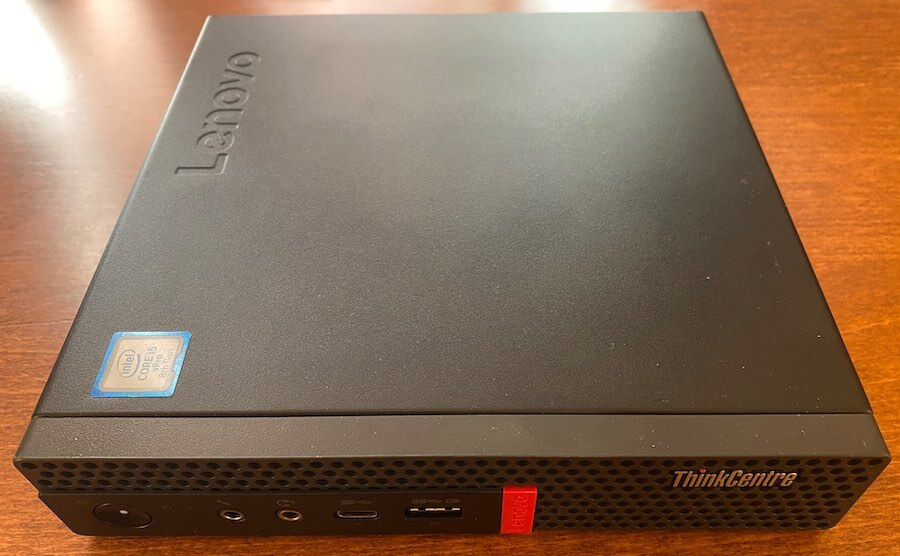
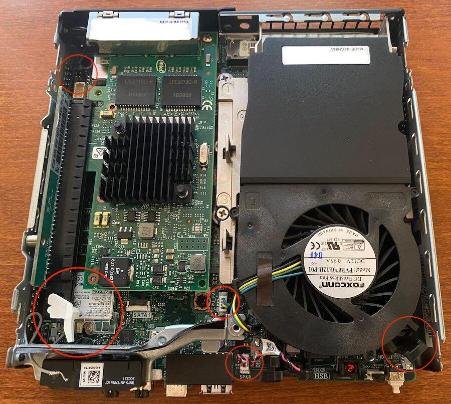
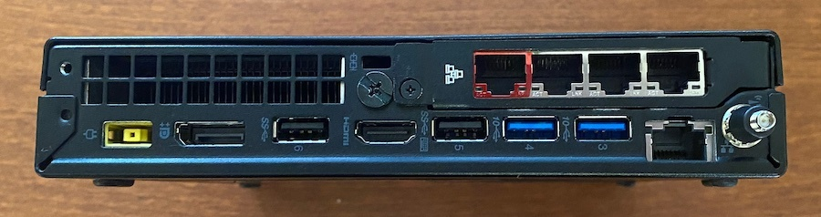

# M920q Router

I have built two of these so far and have found the price to performance ratio, ease of build, and longevity & strong reuse potential of these systems exciting. Here is how I configure my system for OPNsense use.

  

## Bill of Materials:
* Lenovo m920q 1 liter PC ([ebay][5])
* 8Gb DDR4 2666 SODIMM Ram ([ebay][6])
* 128Gb or larger 2280 nvme storage ([ebay][7])
* PCI riser card ([ebay][8])
* Intel I350-T4 Quad Port 1GbE NIC ([ebay][4])
* HDMI Dummy Plug ([ebay][12])
* CR2032 coin cell battery
* small roll of Kapton tape
* isopropyl alcohol
* fine felt tip permanent pen, black and red
* nitrile gloves
* paper towels
* USB Stick(s) for installer media

## Hardware Configuration
There are a few steps that can be done now which will ensure a reliable and repeatable base configuration.
* I recommend you use compressed air in an open space to blow out any dust, dirt, and refuse inside the case first before taking any used gear into your workspace or office.
* Wipe down the external case with isopropyl alcohol, being careful not to unstick any labels.
* Pen over any blemishes in the case with permanent marker (a simple step that can make even well used gear look almost new).
* wipe down the inner walls of the upper and lower case as you proceed.

  

### Replace the BIOS Coin Cell Battery
As these m920q systems are getting old, mine has a build date of 2003, it is sensible to replace the original coin cell BIOS battery.
* remove the top cover
* remove the fan assembly
    - disconnect the speaker cable
    - disconnect the fan cable
    - push the thumb tab near the front corner of the chassis on the fan assembly towards the fan housing to free.
    - fan assembly will hinge from the far (back) end and release after rotating ~45 deg upward.
* remove the black plastic sticker cover of the coin cell holder.
* gently slide the metal retaining tab away from the battery to free the coin cell.
* replace the battery.
Installation is the reverse of removal. I opt not to reinstall the plastic cover for the coin cell, as the retaining glue is often very weak. I found soaking the plastic cover for 5-10 seconds in cleaning alcohol will help regain some of the adhesives stickiness if you would rather keep it attached.

### Factory Reset BIOS
Fully reset the BIOS and BIOS passwords using the JP35 service pins at the rear left (back end, nearest to the wifi antenna port) of the mainboard.
* remove the power cable
* remove the top case
* move the jumper on the JP35 pins (6 total pins in two rows of three) to bridge center positions 3 and 4 from the standard position at 1 and 2.
* remove the lower case
* remove all Ram
* install the lower and top case
* insert the power cable and boot the system

Onboard speaker will play a service tune and repeat. I let it repeat at least twice. 

* Hold the power button to hard power down the system. 
* remove the top and lower case
* return the jumper to pins 1 and 2
* reinstall Ram
* install the lower and top case
* plug in the power cable and boot system to test
* press enter or f1 to access BIOS

### Install Quad Port NIC
There are 4 port and 2 port variants of the i350 card as well as other options. Do be wary of [possible fake cards][9] with possibly lower quality components.

* On your workbench, unscrew the I350-T4 PCI card bracket and retain the single screw
* Attach the PCI riser kit's PCI bracket to the I350-T4 card using the screw from the prior step
* Connect the PCI riser board to the I350-T4 PCI card on the workbench (not in the chassis).
    - Some risers contain PCI release tabs that require the WiFi card be removed to fit. 
    - You can modify the riser card by removing part or all of the PCI release tab as I do, or remove the WiFi card instead.
    - The OEM WiFi card is not compatible with OPNsense and removing it can save you around a watt at idle.
* Remove the top chassis cover
* Remove the SATA 2.5" drive adapter and cable 
	- the cable uses a flip up, zero force style connector
* Optionally remove the WiFi card and use kapton tape to protect and tuck away the antenna leads 
* Unscrew the m920q's OEM PCI bracket (back of case, two screws one on each side of the plate)
* Install both the PCI riser and I350-T4 card as a single item
* Insert the PCI riser retainer screw on the left side of the chassis (left side, middle).
* Screw in the two remaining screws securing the I350-T4 bracket.

## BIOS Configuration

### Update the BIOS

As I write this, the latest released BIOS for the m920q is M1UKT77A/1.0.0.119. As well as various security patches, I noted large reductions in boot times by upgrading my system and recommend it.

* Download the [latest BIOS update from Lenovo][10]
* I prefer installing via the USB Drive Package option.
	- If Lenovo is offline, here is a local copy: [m1ujt77usa.zip](./bios/77usa/m1ujt77usa.zip) and [the readme](./bios/77usa/m1ujt77usa.txt).
* Format your USB stick to FAT32, not ExFat or NTFS
* Copy the files to the USB stick, follow the instructions and allow the system to reboot to complete installation.	  
* Note you can customise the BIOS logo with this tool too if you wish.

### BIOS Settings

I run OPNsense on the metal at 1G speeds, not in a hypervisor. Thus nearly any m920q system will have more than enough performance for the task and can be built with a focus on silent, lower energy operation.

To set a baseline, power on the system and press enter or F1 to access the BIOS. 
* Select Exit -> Load Optimal Defaults
* Select Exit -> OS Optimized Defaults [Disabled]
* Save settings, restart, and access the BIOS again

Adjust settings as appropriate. I set the following:
* Advanced -> CPU Setup -> Turbo Mode [Disabled]
* Power -> After Power Loss [Power On]
* Setup -> CSM [Enabled]
* Devices -> Network setup -> Wireless LAN [Disabled]
* Main -> System Time & Date -> Set current time & date
* Save setting and restart

## Intel vPro MBEx Remote Management

The benefit to the m920q over the m720q is the remote access & management available when connecting via the onboard NIC.  

To retain monitor redirect when running headless, a HDMI dummy plug should be installed. Without one you will still have access to the rest of the MBEx features including remote power settings.

* Boot into the BIOS
* Select Advanced -> Intel Manageability ->
	- Intel Manageability Control [Enabled]
	- Intel Manageability Reset [Enabled]
	- Press <Ctrl-P> to Enter MEBx [Enabled]
* Save and Exit BIOS (press F10)

On reboot press Ctrl-P to enter Intel Remote Management
* Select MEBx Login, default password is `admin`
* Note you must set a complex MBEx password or will receive a Login Error message.
* User Consent -> User Opt-in [NONE]
* Network Setup -> TCP/IP Settings -> Wired LAN IPv4 Configuration
	- Set static IP or DHCP
* Activate Network Access
* Save and exit

## Burn-in Testing

I recommend running [Prime95][13] and [memtest86][14] tests to stress test the CPU, active cooling, and memory systems before installing and configuring as a router.

## OPNsense Installation

Download the [latest version of OPNsense][11] and burn to a USB stick for installation. 

Confirm your I350-T4 PCI card is recognized.
* boot from installer media
* Select `8) Shell`
* run `devinfo | less` and look for a pci device with 4 NICs listed as igb{0,1,2,3}
* Continue installation 

As reference, `em0` is the onboard NIC, and the I350-T4 ports are `igb0-1-2-3` in OPNsense. Ports are physically marked A-D inside the port from left to right as you look at the card. 

I mark my chosen WAN port, the A / igb0 port, with red permanent marker to distinguish it from the rest. 

  

## Online Resources
* Reddit
	- [r/lenovo][15]
	- [r/opnsense][16]
* ServeTheHome.com
	- [m920q Review][17]
	- [Lenovo Tiny series Reference Thread][18]

## Reference Documents
* [User Guide and Hardware Maintenance Manual](./m920q_ughmm_en.pdf) or [download from Lenovo][1]
* [Specifications Sheet](./ThinkCentre_M920_Tiny_Spec.pdf) or [download from Lenovo][2]
* [Marketing Datasheet](./ThinkCentre_M920_Tiny_datasheet_EN.pdf) or [download from Lenovo][3]

[1]: https://download.lenovo.com/pccbbs/thinkcentre_pdf/m920q_ughmm_en.pdf
[2]: https://psref.lenovo.com/syspool/Sys/PDF/ThinkCentre/ThinkCentre_M920_Tiny/ThinkCentre_M920_Tiny_Spec.PDF
[3]: https://psref.lenovo.com/syspool/Sys/PDF/datasheet/ThinkCentre_M920_Tiny_datasheet_EN.pdf
[4]: https://www.ebay.com/sch/i.html?_nkw=Intel+I350-T4
[5]: https://www.ebay.com/sch/i.html?_nkw=m920q+lenovo
[6]: https://www.ebay.com/sch/i.html?_nkw=ddr4+2666+sodimm+hynix
[7]: https://www.ebay.com/sch/i.html?_nkw=2280+128g+nvme
[8]: https://www.ebay.com/sch/i.html?_nkw=m920q+PCI+riser+card
[9]: https://forums.servethehome.com/index.php?threads/comparison-intel-i350-t4-genuine-vs-fake.6917
[10]: https://support.lenovo.com/us/en/downloads/ds503907-flash-bios-update-thinkcentre-m720t-m720s-m720q-m920t-m920s-m920q-m920x-thinkstation-p330-tiny
[11]: https://opnsense.org/
[12]: https://www.ebay.com/sch/i.html?_nkw=hdmi+dummy+plug+1080p
[13]: https://www.mersenne.org
[14]: https://www.memtest86.com/memtest86.html
[15]: https://www.reddit.com/r/Lenovo/search/?q=m920q
[16]: https://www.reddit.com/r/opnsense/search/?q=m920q
[17]: https://www.servethehome.com/lenovo-thinkcentre-m920-and-m920q-tiny-guide-and-review/
[18]: https://forums.servethehome.com/index.php?threads/lenovo-thinkcentre-thinkstation-tiny-project-tinyminimicro-reference-thread.34925/